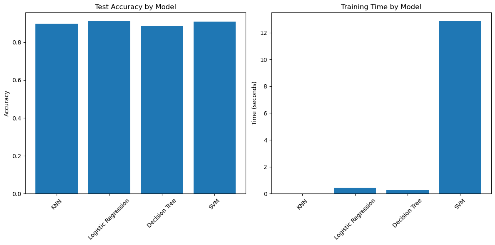
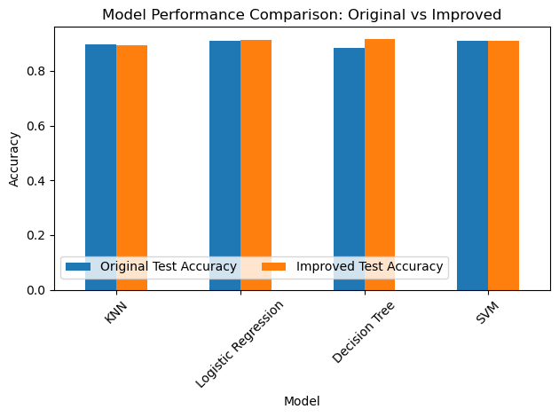
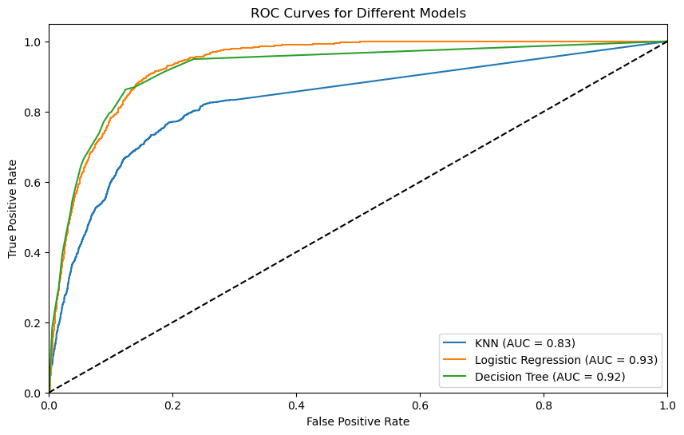

# 🏦 Bank Marketing Campaign Classification Analysis

## 📄 Overview

This project analyzes a dataset from a Portuguese banking institution containing the results of multiple marketing campaigns. The goal is to predict whether a client will subscribe to a term deposit based on various features related to the client, the campaign, and economic factors. Four different classification models were compared to determine the most effective approach for predicting customer responses.

## 🗃️ Project Organization

* `notebook/classification_model_comparison.ipynb` The Jupyter notebook containing the data cleaning, analysis, and modeling steps.
* `data/bank-additional-full.csv` The dataset used for the analysis.
* `images/` Folder containing the relevant plots and visualizations used in the analysis.

## 📊 Data

The dataset includes various features related to:
* Client Information:
    * Age, job, marital status, education, credit status
    * Existing loans (housing, personal)
* Campaign Information:
    * Contact type (cellular/telephone)
    * Month and day of contact
    * Duration of contact
    * Campaign details (number of contacts, previous campaign outcomes)
* Economic Indicators:
    * Employment variation rate
    * Consumer price index
    * Consumer confidence index
    * Euribor 3-month rate
    * Number of employees

**Target Variable:** Whether the client subscribed to a term deposit (yes/no)
The dataset can be found in `data/bank-additional-full.csv`

## ✨ Data Preprocessing

The following steps were taken to clean and prepare the data:

1. Feature Engineering
    * Categorical variables were converted using one-hot encoding `OneHotEncoder`.
    * Target variable `y` was encoded to binary format.
2. Data Splitting
    * The data was split into training and testing sets (80% train, 20% test) for model training and evaluation.
3. Feature Scaling:
    * `StandardScaler` applied to numerical features

## 🔍 Key Findings

### Model Performance

Initial Model Results:
```
KNN: 89.82% accuracy
Logistic Regression: 91.15% accuracy
Decision Tree: 88.77% accuracy
SVM: 90.91% accuracy
```



Improved Model Results (After Grid Search):
```
KNN: 89.37% accuracy
    Best parameters: n_neighbors=9, weights='distance'
Logistic Regression: 91.16% accuracy
    Best parameters: C=0.1, solver='lbfgs'
Decision Tree: 91.51% accuracy
    Best parameters: max_depth=5, min_samples_split=5
SVM: 90.91% accuracy
    Best parameters: C=1, kernel='rbf'
```


The **Decision Tree** model showed the best performance after optimization, with a test accuracy of 91.51%.

💡 Key Findings

1. Model Performance:
    * Decision Tree classifier performed best after optimization
    * All models showed consistent performance above 89% accuracy
    * Significant improvement achieved through hyperparameter tuning

2. Training Efficiency:
    * KNN and Decision Tree showed fastest training times
    * SVM had significantly longer training time (`>12 seconds`)
    * Logistic Regression maintained good balance between speed and accuracy



## 🎯 Recommendations

In my analysis, I found that the Decision Tree classifier performed best with 91.51% accuracy after optimization, followed closely by Logistic Regression at 91.16%. Through my modeling, I discovered that successful term deposit subscriptions are highly dependent on the contact duration, timing, and economic indicators. For the banking institution, I recommend implementing the Decision Tree model for customer targeting, with Logistic Regression as a reliable alternative when faster processing is needed. I observed high accuracy across all models, indicating strong predictive power using the current features. Based on my findings, I suggest the bank prioritize longer contact durations when possible, focus on the most successful months for campaigns, and consider economic indicators when planning campaign timing. Additionally, I recommend maintaining a balanced approach between cellular and telephone contact methods while monitoring and adapting to changing economic conditions to optimize conversion rates. In my professional opinion, the implementation should include regular model retraining to maintain performance accuracy and establish a monitoring system to track prediction accuracy across different customer segments.

## 🔮 Next Steps & Recommendations

* Model Improvement:
    * Explore ensemble methods (Random Forest, XGBoost)
    * Investigate feature interactions
    * Collect additional relevant features
* Further Analysis:
    * Conduct cost-benefit analysis of false positives vs. false negatives
    * Analyze feature importance for business insights
    * Investigate seasonal patterns in campaign success
